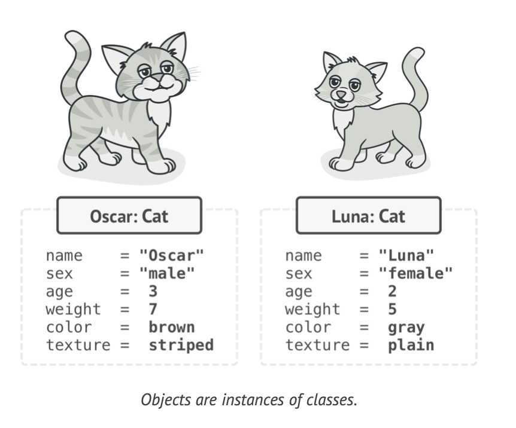
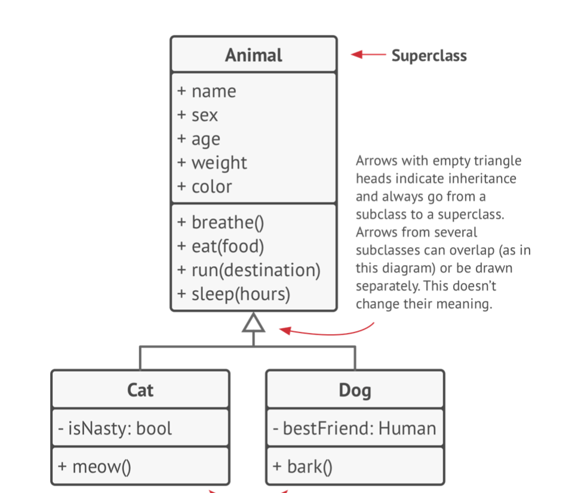
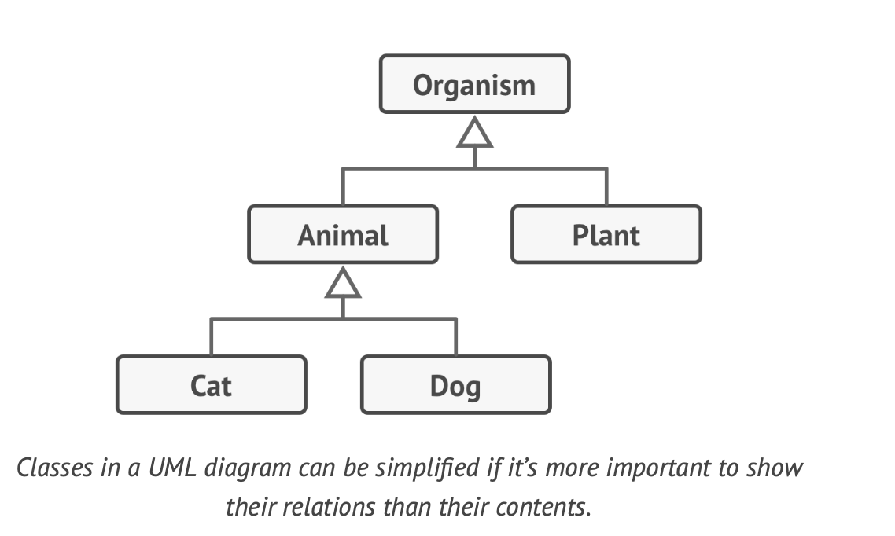
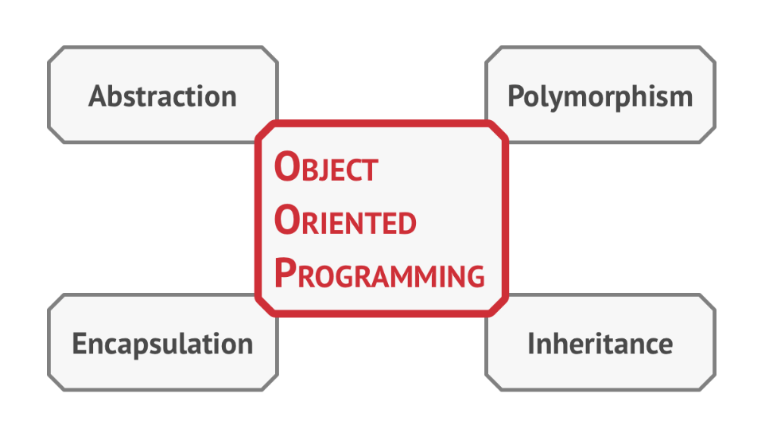
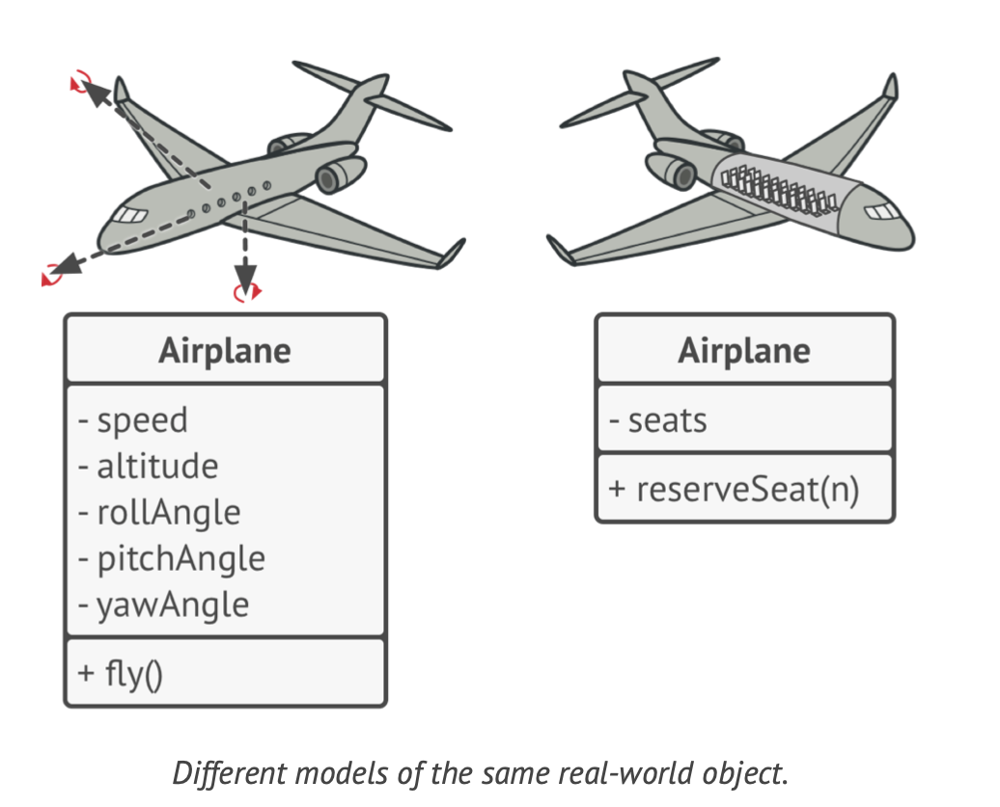
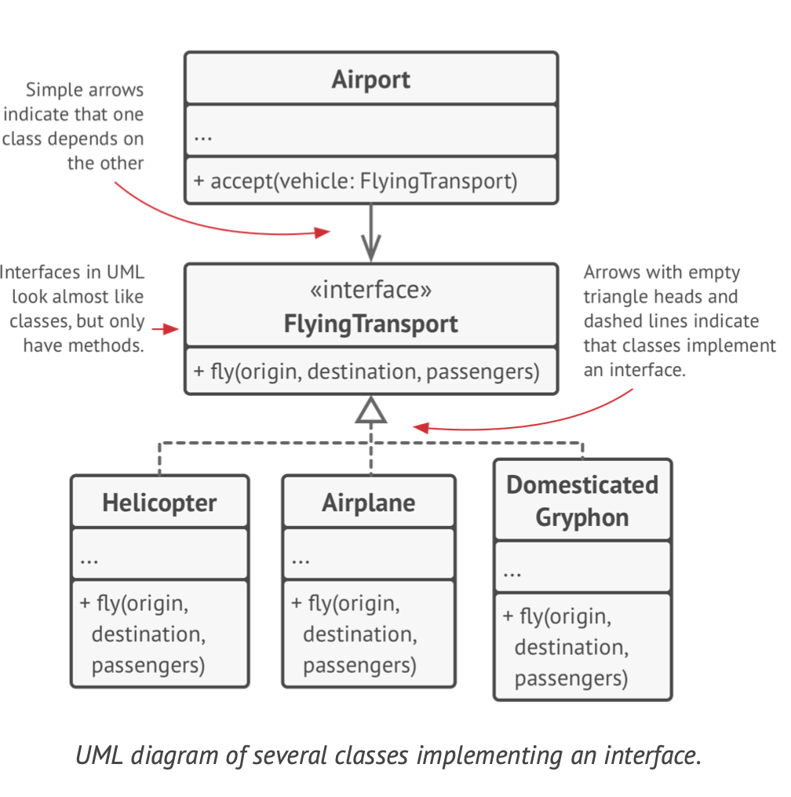
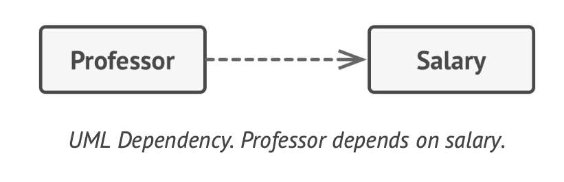
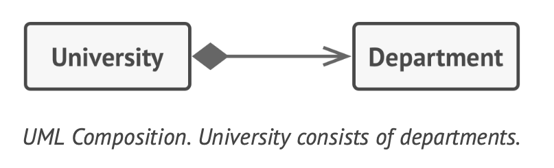
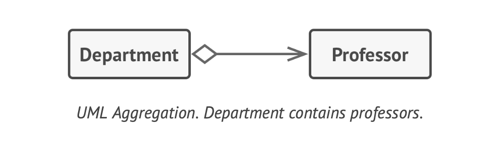

# Introduction to Object Oriented Programming

## Basics of OOP 

Object Oriented Programming is a paradigm / concept of wrapping pieces of data and behavior related to that data into special bundles called objects 


```
class Cat: 
    + name
    + gender 
    + age
    + weight 
    + color 

    + breath()
    + eat(food)
    + run(destination)
    + sleep(hours)
    + meow()
```

> `+` Represents Public Members and `-` represents Private Members 

**Objects are Instances of Classes**




## Class Hierarchies 

Classes can be defined in hierarchial structure when they have certain common attributes and behaviors 

Example: Dogs and Cats have certain commonalities and can we classified through Animal Class 



We can further expand this hierarchy to `Organisms` , `Animals` and `Plants` 



Subclasses can override the behavior and methods that they inherit from parent classes. 

A Subclass can either completely replace the default behavior or just enhance it with some extra stuff 


## Pillars of OOP 



### Abstraction 

Abstraction is a model of a real world object or phenomenon limited to a specific context, which represents all details relevant to this context with high accuracy and omits all the rest 




### Encapsulation 

Encapsulation is the ability of an object to hide parts of its state and behaviors from other objects, exposing only a limited interface to the rest of the program . 

To encapsulate something means to make it `private` and thus accessible only from within of the methods of its own class. 



### Inheritance 

Inheritance is the ability to build new classes on top of exist- ing ones. The main benefit of inheritance is code reuse. If you want to create a class that’s slightly different from an existing one, there’s no need to duplicate code. Instead, you extend the existing class and put the extra functionality into a resulting subclass, which inherits fields and methods of the superclass.

The Consequence of inheritance is that You can’t hide a method in a subclass if it was declared in the superclass. You must also implement all abstract methods, even if they don’t make sense for your subclass.

> In the latest versions of Java this can be avoided through `default` methods of `Interfaces` 

In Most programming languages one Subclass can extend only one Super Class to avoid Diamond Problem. But they can implement multiple Interfaces and if the Interfaces have same default methods they the Implementing Class should override the default method 


### Polymorphism 

Polymorphism is the ability of a program to detect the real class of an object and call its implementation even when its real type is unknown in the current context. This is result of inheritance and abstraction 


## Relations between Objects 

In addition to inheritance and implementation that we have already seen, there are other types of relations between objects. 


### Association

Association is one type of relationship where one object uses or interacts with another. In UML Diagration the association relationship is shown by a **simple arrow drawn from an object and pointing to the object it uses**

In General we use association to represent something like a field in a class. The Link is always there, in that you can always ask an order for its Customer 


### Dependency 

Dependency is a weaker variant of association that usually implies that there’s no permanent link between objects. Dependency typically (but not always) implies that an object accepts another object as a method parameter, instantiates, or uses another object



### Composition 

Composition is a "Whole-Part" relationship between two objects, one of which is composed of one or more instances of the other. The distinction between this relation and others is that the component can only exist as a part of the container 



> While we talk about relations between objects, keep in mind that UML represents relations between classes. It means that a university object might consist of multiple departments even though you see just one “block” for each entity in the diagram. UML notation can represent quantities on both sides of relationships, but it’s okay to omit them if the quantities are clear from the context.


### Aggregation 

Aggregation is a less strict variant of composition, where one object merely contains a reference to another. The contain- er doesn’t control the life cycle of the component. The com- ponent can exist without the container and can be linked to several containers at the same time.

